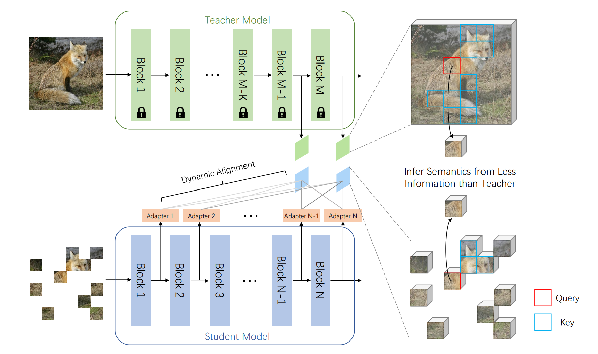

# MaskAlign

<p align="center">

</p>


This is the official PyTorch repository for paper [Stare at What You See: Masked Image Modeling without Reconstruction](https://arxiv.org/abs/2211.08887):
```
@article{xue2022stare,
  title={Stare at What You See: Masked Image Modeling without Reconstruction},
  author={Xue, Hongwei and Gao, Peng and Li, Hongyang and Qiao, Yu and Sun, Hao and Li, Houqiang and Luo, Jiebo},
  journal={arXiv preprint arXiv:2211.08887},
  year={2022}
}
```

* This repo is a modification on the [MAE repo](https://github.com/facebookresearch/mae). Installation and preparation follow that repo.

* The teacher models in this repo are called from [Huggingface](https://huggingface.co/). Please install transformers package by running: <br> `pip install transformers`.

## Pre-training

To pre-train ViT-base (recommended default) with **distributed training**, run the following on 8 GPUs:

```
python -m torch.distributed.launch --nproc_per_node=8 main_pretrain.py \
    --batch_size 128 \
    --model mae_vit_base_patch16 \
    --blr 1.5e-4 \
    --min_lr 1e-5 \
    --data_path ${IMAGENET_DIR} \
    --output_dir ${OUTPUT_DIR} \
    --target_norm whiten \
    --loss_type smoothl1 \
    --drop_path 0.1 \
    --head_type linear \
    --epochs 200 \
    --warmup_epochs 20 \
    --mask_type attention \
    --mask_ratio 0.7 \
    --loss_weights top5 \
    --fusion_type linear \
    --teacher_model openai/clip-vit-base-patch16
```

- Here the effective batch size is 128 (`batch_size` per gpu) * 8 (gpus) = 1024. If memory or # gpus is limited, use `--accum_iter` to maintain the effective batch size, which is `batch_size` (per gpu) * `nodes` * 8 (gpus) * `accum_iter`.
- `blr` is the base learning rate. The actual `lr` is computed by the [linear scaling rule](https://arxiv.org/abs/1706.02677): `lr` = `blr` * effective batch size / 256.
- This repo will automatically resume the checkpoints by keeping a "latest checkpoint".

To train ViT-Large, please set `--model mae_vit_large_patch16` and `--drop_path 0.2`. Currently, this repo supports three teacher models: `--teacher_model ${TEACHER}`, where `${TEACHER} in openai/clip-vit-base-patch16, openai/clip-vit-large-patch14 and facebook/dino-vitb16`.

## Fine-tuning

Get our pre-trained checkpoints from [here](ModelCard.md).

To fine-tune ViT-base (recommended default) with **distributed training**, run the following on 8 GPUs:
```
python -m torch.distributed.launch --nproc_per_node=8 main_finetune.py \
    --epochs 100 \
    --batch_size 128 \
    --model vit_base_patch16 \
    --blr 3e-4 \
    --layer_decay 0.55 \
    --weight_decay 0.05 \
    --drop_path 0.2 \
    --reprob 0.25 \
    --mixup 0.8 \
    --cutmix 1.0 \
    --dist_eval \
    --finetune ${PT_CHECKPOINT} \
    --data_path ${IMAGENET_DIR} \
    --output_dir ${OUTPUT_DIR}
```

- Here the effective batch size is 128 (`batch_size` per gpu) * 8 (gpus) = 1024.
- `blr` is the base learning rate. The actual `lr` is computed by the [linear scaling rule](https://arxiv.org/abs/1706.02677): `lr` = `blr` * effective batch size / 256.

To fine-tune ViT-Large, please set `--model vit_large_patch16 --epochs 50 --drop_path 0.4 --layer_decay 0.75 --blr 3e-4`.


## Linear Probing

Run the following on 8 GPUs:
```
python -m torch.distributed.launch --nproc_per_node=8 main_linprobe.py \
    --epochs 90 \
    --batch_size 2048 \
    --model vit_base_patch16 \
    --blr 0.025 \
    --weight_decay 0.0 \
    --dist_eval \
    --finetune ${PT_CHECKPOINT} \
    --data_path ${IMAGENET_DIR} \
    --output_dir ${OUTPUT_DIR}
```
- Here the effective batch size is 2048 (`batch_size` per gpu) * 8 (gpus) = 16384.
- `blr` is the base learning rate. The actual `lr` is computed by the [linear scaling rule](https://arxiv.org/abs/1706.02677): `lr` = `blr` * effective batch size / 256.

